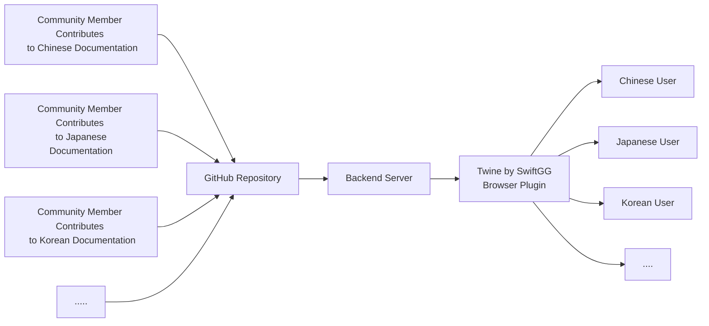

<div align="center">

</div>
[简体中文](./README-CN.md)

Twine by SwiftGG is a browser extension designed to help iOS developers learn and understand Apple's official documentation more easily. Based on community-contributed localized content, it can identify English content in Apple's documentation and provide bilingual translation, assisting developers in their learning tasks.

## Table of Contents

1. Initial Intent
2. Project Plan
3. Features and Usage
4. FAQs
5. Feature Roadmap
6. About Us

## Initial Intent

Apple provides interactive learning tutorials with clear explanations for beginners to learn iOS development knowledge. Many beginners have successfully learned iOS development and created unique and outstanding products through these tutorials. The quality of official documentation is high, but there are still some imperfections, such as lack of non-English language support and delays in updating to the latest versions. This may lead to some difficulties and confusion for learners during the learning process.

The primary purpose of creating this plugin is to help iOS developers learn and understand SwiftUI official documentation more easily. We aim to reduce the learning curve and encourage more people to join the iOS development community. At the same time, we look forward to the power of the community, actively participating in the development and improvement of the plugin and translations, so that the plugin can continuously grow and better serve everyone.

In the future, we hope Twine by SwiftGG will become a helpful tool for both beginners and experienced developers, not only covering SwiftUI but also expanding to other Apple official documentation. We anticipate working with community members to make contributions to open-source projects and collectively advance technological development.

## Project Plan



In terms of user experience, we adopt an immersive translation approach, with non-English translation and English references arranged side by side, and you can also customize the display mode. This plan retains the immersive user experience while incorporating the power of the community, allowing more people to participate, which means the plugin will generate more language versions, leading to more efficient iterations and interesting exchanges and communications.

Currently, Twine by SwiftGG is a completely open-source project consisting of 3 repositories:

- Browser Plugin Repository: https://github.com/SwiftGGTeam/swiftgg-trans-plugin
- Data Backend Repository: https://github.com/SwiftGGTeam/swiftui-trans-api
- Localization File Repository: https://github.com/SwiftGGTeam/swiftui-tutorial-chinese

## Features and Usage

Currently, we support three interactive tutorial documents, which are:

- [Introducing SwiftUI](https://developer.apple.com/tutorials/swiftui)
- [Learning SwiftUI](https://developer.apple.com/tutorials/swiftui-concepts/)
- [Exploring SwiftUI Sample Apps](https://developer.apple.com/tutorials/sample-apps)


Using the plugin is very simple. Just click on the extension, enable automatic translation, and navigate to the corresponding tutorial page to see the content automatically translated. You can switch between translation display modes according to your preference. If you don't want to see the translation temporarily, you can disable it for the current page with a toggle switch. It's easy to get started with just a simple click.

### Installation

Currently, you can download this plugin from the following browser extension stores:

- [Download on Chrome Web Store](https://chrome.google.com/webstore/detail/twine-by-swiftgg/kelkibamnlfhadhkaonlpplfiidhbofk) 
- [Download on macOS App Store](https://apps.apple.com/cn/app/twine-by-swiftgg/id6451390893)
- [Download on iOS App Store](https://apps.apple.com/cn/app/twine-by-swiftgg/id6451390893)

**Install with Srouce Code**

1. Clone this repository:

```sh
git clone <https://github.com/SwiftGGTeam/swiftgg-trans-plugin.git>
```

2. Based on your browser type, choose the corresponding installation method.

- For **Google Chrome** users:
    1. Open the `chrome://extensions/` page.
    2. Enable `Developer mode` in the upper right corner.
    3. Click on `Load unpacked`, then select the repository folder cloned to your local machine.
- For **Mozilla Firefox** users:
    1. Open the `about:debugging` page.
    2. Click on `This Firefox`, then click `Load Temporary Add-on...`
    3. Modify the `"service_worker": "./background.js"` in the `manifest.json` file to `"scripts": ["./background.js"]`.
    4. Add `"declarativeNetRequest"` and `"browsingData"` to the `permissions` in the `manifest.json` file.
    5. Choose the `manifest.json` file in the local repository folder.
- For **Microsoft Edge** users:
    1. Open the `edge://extensions/` page.
    2. Enable `Developer mode` in the lower right corner.
    3. Click on `Load unpacked`, then select the local repository folder.
- For **Safari** users:

    1. Build the project `Twine by SwiftGG safari` in Xcode.

    **Open the "Develop" menu**

    2. Select Safari > Preferences.
    3. Select the Advanced tab.
    4. Enable the "Show Develop menu in menu bar" option.

    **Allow "Unsigned Extensions," the setting will be reset when Safari is closed and needs to be reset again when opened.**

    5. Open Safari and select "Develop," then allow unsigned extensions.
    6. Select Safari > Preferences.
    7. Select Extensions, find our extension in the list, and enable it.

## FAQs

### How to report bugs/features for the plugin?

If you encounter any issues during use or have new feature requests, you are welcome to provide feedback through **[GitHub Issues](https://github.com/SwiftGGTeam/swiftgg-trans-plugin/issues)**. When creating an issue, please describe the problem or request in detail to facilitate a faster resolution.

### How to contribute code to the plugin?

Contributions to this project are welcome! If you want to submit code to the project, you can directly submit a Pull Request for modification. When submitting a Pull Request, please briefly describe the changes and reasons for the modifications. If there are significant changes, it's best to communicate with us before submitting so that we can better understand your contributions. You can refer to SwiftGG's [Pull Request Guide](https://github.com/SwiftGGTeam/translation/blob/master/%E7%BF%BB%E8%AF%91%E6%B5%81%E7%A8%8B%E6%A6%82%E8%BF%B0%E5%8F%8APR%E8%AF%B4%E6%98%8E.md#%E5%A6%82%E4%BD%95%E5%8F%91%E8%B5%B7-pull-request) for how to initiate a Pull Request.

### How to correct or modify translated content?

If you find errors or need to make corrections to the translated content, you can click on [SwiftUI-Tutorial-Chinese](https://github.com/SwiftGGTeam/swiftui-tutorial-chinese) to see how to submit changes.

### Other questions

If you have any other questions or suggestions, please feel free to contact us through **[GitHub Issues](https://github.com/SwiftGGTeam/swiftgg-trans-plugin/issues)**. We will respond promptly and address your concerns.

## Feature Roadmap

In the next stage, we have the following plans:

- Browser Plugin
  - Support for multiple languages
  - Support for iOS version of Safari browser
- Data Backend Repository
  - Refactor the backend using Vapor framework
  - Optimize the matching rules for English content in web pages to support more pages
- Localized Document Library
  - Provide more localized documentation for learning materials
  - Enhance the format and content editing experience of translated documents

## About Us

SwiftGG is a community dedicated to providing high-quality technical articles in Chinese for Swift language and iOS developers. We are passionate about sharing technical knowledge and experiences, and through this plugin, as well as other activities and projects in the community, we aim to help more developers learn and understand Swift and iOS development better.

If you are interested in our project or want to learn more about SwiftGG, please visit our official website: [https://swiftgg.com](https://swiftgg.com/). 

You can also follow us through the following channels:

- **[GitHub](https://github.com/SwiftGGTeam)**
- **[Weibo](https://weibo.com/swiftguide)**

### Development Team

- [SketchK](https://github.com/SwiftGGTeam/swiftgg-trans-plugin/commits?author=SketchK)
- [zyterence](https://github.com/zyterence)
- [OneeMe](https://github.com/OneeMe)
- [IanIsMyUsername](https://github.com/IanIsMyUsername)
- [hiETsang](https://github.com/hiETsang)
- [Ryan-BetterMe](https://github.com/Ryan-BetterMe)
- [JacobMao](https://github.com/JacobMao)
- [RyanZhu](https://github.com/underthestars-zhy)
- [yongfrank](https://github.com/yongfrank)
- [KiwiGuo](https://kiwig.xyz/)
